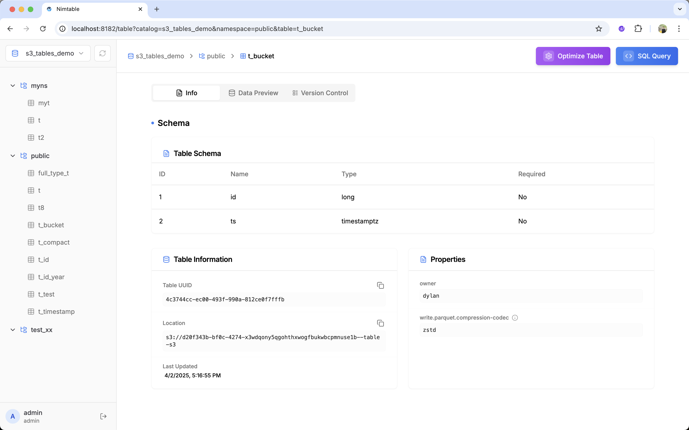
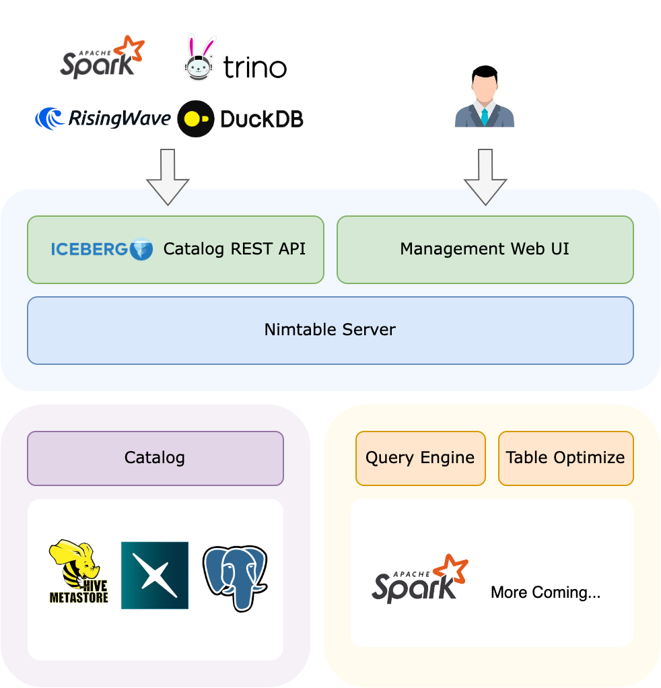

Nimtable
===================

Nimtable is a simple UI for browsing Apache Iceberg catalogs. It's still under development. 🚧



## Architecture

The Nimtable server can be configured to connect to different catalog servers, such as Hive Metastore, PostgreSQL via JDBC catalog, or REST Catalog such as Apache Polaris. On top of that, Nimtable provides a human-friendly UI for browsing, querying and optimizing Iceberg tables.

Besides, Nimtable also serves as a standard Iceberg REST Catalog, which means it can adapt any underlying catalog implementation to the standard RESTful Catalog API.



## Development

To develop, JDK 17 and Node.js 23 are required.

Start the backend server with:

```bash
cd backend
./gradlew run
```

The UI will be available at http://localhost:8182.

To test the UI, you need to run a catalog server separately. For example, you can use the [Spark + Iceberg Quickstart Image](https://github.com/databricks/docker-spark-iceberg/).

```bash
git clone https://github.com/databricks/docker-spark-iceberg.git
docker-compose up

docker exec -it spark-iceberg spark-sql # create tables, insert data, etc.
```

### Develop frontend

The frontend can also be developed separately by running the following commands:

```bash
npm install
npm run dev
```

### Lints

Fix lint issues:
```bash
# Frontend
# check lint
npm run lint
# fix lint
npm run lint -- --fix

# Backend
# check lint
cd backend && ./gradlew spotlessCheck
# fix lint
cd backend && ./gradlew spotlessApply
```

## Roadmap

- **Pluggable Query Engines**. Connect to different query engines, such as DuckDB (embedded), Spark, Flink, RisingWave, etc.
- **Table Optimize**. Run table maintenance operations, such as compaction and garbage collection with pluggable backends. (Work in progress)
- **Query Console**. A user-friendly console for running ad-hoc queries.
- **Authentication**. Support user management and authentication.