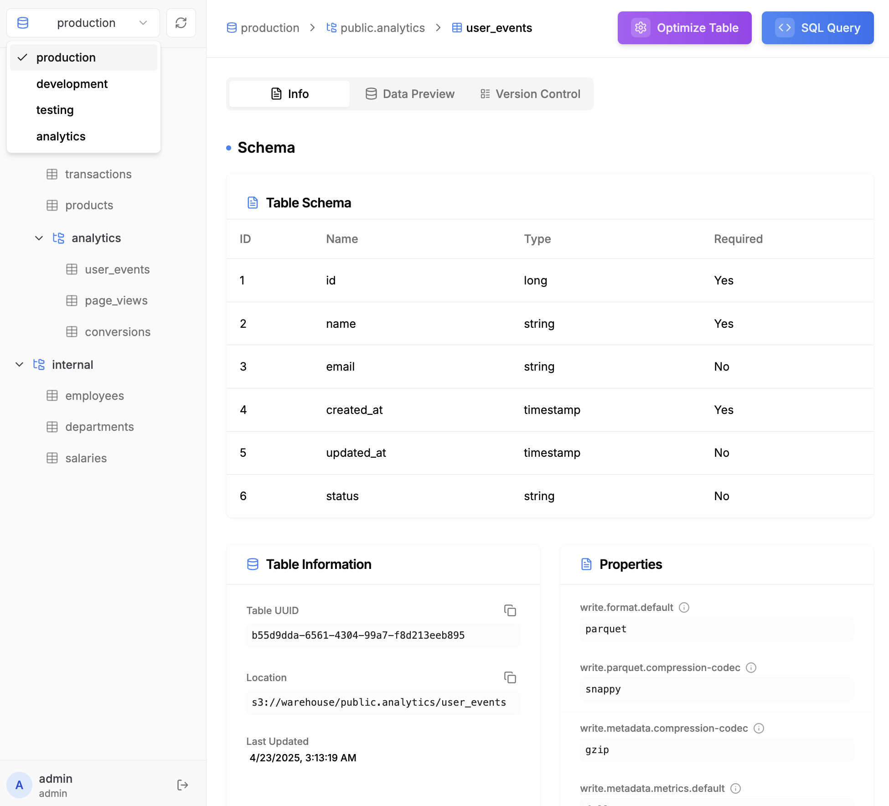

<div align="center">

# Nimtable: The Control Plane for Apache Iceberg™

</div>

<div align="center">

<b> A lightweight, easy-to-use platform to monitor, optimize, and govern your Iceberg-based lakehouse. </b>

</div>

<div align="center">
  <a
    href="https://go.nimtable.com/slack"
    target="_blank"
  >
    
  </a>
</div>





## Overview

Nimtable helps you easily manage and explore Apache Iceberg catalogs. With a web-based platform designed for clarity and simplicity, Nimtable makes it easy to browse tables, run queries, analyze file distributions, and optimize storage layouts.


### Key Features

- 🌟 **Multi-Catalog Support**: Connect to Hive Metastore, PostgreSQL (via JDBC), REST Catalog, AWS Glue, and S3 Tables.
- 🔍 **Table Exploration**: Inspect table schemas, partitions, and snapshots.
- ⚡ **Interactive Querying**: Execute SQL queries directly from the platform.
- 📊 **File Distribution Analysis**: Visualize how data files are distributed across partitions and snapshots.
- 🔧 **Table Optimization**: Run file compaction and manage snapshot expiration.
- 🔌 **REST Catalog Compatibility**: Serve as a standard Iceberg REST Catalog, adapting any underlying catalog to a RESTful API.

## Architecture

Nimtable acts as a bridge between users and catalog servers, providing both an interactive web interface and a standard REST Catalog API layer.


## Quick Start

The fastest way to get started is using Docker:

```bash
cd docker

# Start the service
docker compose up -d

# View logs
docker compose logs -f

# Stop the service
docker compose down
```

Access the UI at http://localhost:8182

## Configuration

Nimtable uses YAML for configuration, supporting both server settings and catalog connections. The configuration format is compatible with Spark's Iceberg catalog configuration. You can configure catalogs in two ways:

1. **Configuration File**: Configure catalogs via YAML configuration (recommended for experts)
2. **Web Interface**: Configure catalogs through the Nimtable UI (recommended for new users)

For Docker deployments, you can find a sample configuration file at [docker/config.yaml](./docker/config.yaml).

### Server Configuration

```yaml
server:
  port: 8182
  host: 0.0.0.0
admin:
  username: admin
  password: admin
database:
  url: jdbc:postgresql://localhost:5432/nimtable_db
  username: nimtable_user
  password: password
```

### Database Configuration

Nimtable needs a database to store data. Currently, SQLite and PostgreSQL are supported.
For production, PostgreSQL is recommended. If you deploy with the `docker-compose.yml` file,
a Postgres container is included.

You can also use your own Postgres database by setting the `url`, `username`, and `password`
in `config.yaml`.

### Catalog Configuration Examples

#### REST Catalog

```yaml
catalogs:
  - name: rest-catalog
    type: rest
    uri: http://localhost:8181
    warehouse: s3://warehouse/wh/
    io-impl: org.apache.iceberg.aws.s3.S3FileIO
    s3.endpoint: http://localhost:9000
    s3.access-key-id: admin
    s3.secret-access-key: password
    s3.region: us-east-1
    s3.path-style-access: true
    client.region: us-east-1
```

#### AWS S3 Tables

```yaml
catalogs:
  - name: s3-tables-catalog
    type: rest
    uri: https://s3tables.us-east-1.amazonaws.com/iceberg
    warehouse: arn:aws:s3tables:us-east-1:xxxxx:bucket/your-bucket
    io-impl: org.apache.iceberg.aws.s3.S3FileIO
    s3.access-key-id: admin
    s3.secret-access-key: password
    s3.region: us-east-1
    s3.path-style-access: true
    rest.sigv4-enabled: true
    rest.signing-name: s3tables
    rest.signing-region: us-east-1
```

#### JDBC Catalog (e.g. PostgreSQL)

```yaml
catalogs:
  - name: jdbc-catalog
    type: jdbc
    jdbc.schema-version: V1
    uri: jdbc:postgresql://localhost:5432/db
    warehouse: s3://warehouse/wh/
    jdbc.user: admin
    jdbc.password: password
    # S3 Configuration
    io-impl: org.apache.iceberg.aws.s3.S3FileIO
    s3.endpoint: http://localhost:9000
    s3.access-key-id: admin
    s3.secret-access-key: password
    s3.region: us-east-1
    s3.path-style-access: true
    client.region: us-east-1
```

#### AWS Glue Catalog

You need to provide AWS credentials for Glue Catalog access. You can do this by either mounting the AWS credentials file or using environment variables. See the section below for details.


```yaml
catalogs:
  - name: glue-catalog
    type: glue
    warehouse: s3://your-bucket/test
```

### AWS Credential Configuration in Docker

There are two ways to configure AWS credentials in Docker:

1. Using Environment Variables:
```yaml
# docker-compose.yml
services:
  nimtable:
    environment:
      - AWS_REGION=us-east-1
      - AWS_ACCESS_KEY_ID=your-access-key
      - AWS_SECRET_ACCESS_KEY=your-secret-key
```

2. Mounting AWS Credentials File (Read-only):
```yaml
# docker-compose.yml
services:
  nimtable:
    volumes:
      - ~/.aws/credentials:/root/.aws/credentials:ro
```


## Development

See [HACKING.md](docs/HACKING.md) for details on how to hack on Nimtable.

## Roadmap

- 🔧 **Optimized Compaction**: Advanced compaction strategies and scheduling
- 📊 **Monitoring & Analytics**: Comprehensive dashboard and insights
- 💾 **Caching**: Database integration and metadata caching
- ⚡ **Query Engine Integration**: Support for multiple query engines
- 📋 **Metadata Management**: Enhanced snapshot, schema and partition management
- 🔐 **Security & Access Control**: RBAC and fine-grained permissions
- 🔌 **API & Integration**: REST API support and authentication
- 🔄 **Data Lineage**: Table and column-level lineage tracking
- 🏢 **Catalog & Warehouse Integration**: Support for various storage backends

For detailed roadmap items and progress tracking, see [Roadmap](https://github.com/nimtable/nimtable/issues/50).

## Contributing

We welcome contributions! Please see our [Contributing Guide](CONTRIBUTING.md) for details.

## License

This project is licensed under the Apache License 2.0 - see the [LICENSE](LICENSE) file for details.
