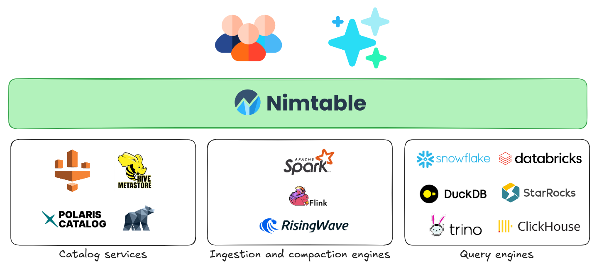

<div align="center">

# Nimtable: Observability for Apache Iceberg™

</div>

<div align="center">

<b> Nimtable is a lightweight web platform for exploring and managing Apache Iceberg catalogs and tables. </b>

</div>

<div align="center">
  <a
    href="https://go.risingwave.com/slack"
    target="_blank"
  >
    
  </a>
</div>


## Overview

Nimtable provides a clean interface and REST API for Apache Iceberg.
It helps engineers inspect catalog metadata, view table schemas and partitions, analyze file layouts, and manage routine maintenance workflows through existing compute engines such as [Apache Spark](https://spark.apache.org/) or [RisingWave](https://github.com/risingwavelabs/risingwave).

## Core Capabilities

- Connect to multiple catalogs including REST, AWS Glue, and S3 Tables.
- Explore tables, schemas, partitions, snapshots, and manifests.
- Run SQL queries directly from the browser for quick inspection.
- Visualize file and snapshot distribution to identify optimization opportunities.
- Integrate with external engines like Spark or RisingWave to manage compaction and maintenance tasks.
- Serve as a standard Iceberg REST Catalog API endpoint.

## Architecture

Nimtable runs between users and Iceberg catalogs.
It provides both a REST API and a browser-based console for interactive metadata management.



## Quick Start

The fastest way to get started is using Docker:

```bash
cd docker
docker compose up -d
```

Access the UI at [http://localhost:3000](http://localhost:3000).

#### Default Admin Login

- **Username:** `admin`
- **Password:** `admin`

> **Important:** After your first login, we strongly recommend changing the default admin password through the web interface for security. Once changed, the password will be stored in the database and environment variables will no longer be used for authentication.

You can customize the initial admin credentials by setting environment variables in your `docker-compose.yml`:

```yaml
services:
  nimtable-web:
    environment:
      - ADMIN_USERNAME=your-admin-username
      - ADMIN_PASSWORD=your-secure-password
```

**Note:** Environment variables only set the initial password. Once you change the password through the web interface, the new password will be stored in the database and environment variables will be ignored for authentication purposes.

---

## Managing the Service (Optional)

- **View logs:**
  ```bash
  docker compose logs -f
  ```
- **Stop the service:**
  ```bash
  docker compose down
  ```

## Development

See [HACKING.md](docs/HACKING.md) for details on how to hack on Nimtable.

## Configuration

Nimtable can be configured in two ways:

- **Web UI:** Easiest for new users - just log in and click "Create Catalog."
- **YAML Configuration File:** Recommended for advanced users or automated deployments.

### 1. Configuration File Location

- By default, Nimtable looks for `config.yaml` in the working directory.
- **Docker:** Mount your config file to `/app/config.yaml` inside the container.
- See [docker/docker-compose.yml](./docker/docker-compose.yml) for an example of mounting configuration.

### 2. Minimal Configuration Example

```yaml
server:
  port: 8182
  host: 0.0.0.0
database:
  url: jdbc:postgresql://localhost:5432/nimtable_db
  username: nimtable_user
  password: password
```

> **Important:** Change the default admin password after your first login for security. Once changed through the web interface, the password will be stored in the database and environment variables will no longer be used for authentication.

### 3. Admin Password Management

The default admin password can be changed through the web interface after login. Once changed:
- The new password is stored in the database
- Environment variables (`ADMIN_USERNAME` and `ADMIN_PASSWORD`) are ignored for authentication
- The password change is persistent across container restarts

### 4. Catalog Configuration

You can add catalogs in two ways:

- **Web UI:**  
  After logging in, click "Create Catalog" and follow the prompts. Catalogs added via the UI are stored in the internal database and do not modify `config.yaml`.

- **YAML File:**  
  Pre-configure catalogs by adding them to your `config.yaml`.  
  See [backend/config.yaml](./backend/config.yaml) for full examples and templates.

**Supported Catalog Types:**  
- REST
- AWS Glue
- S3 Tables
- PostgreSQL (via JDBC)

Each catalog type may require specific fields. Refer to the sample config for details.

### 5. AWS Credential Configuration

If you use AWS Glue or S3, you can provide credentials in two ways:

- **Environment Variables:**
  ```yaml
  # docker-compose.yml
  services:
    nimtable:
      environment:
        - AWS_REGION=us-east-1
        - AWS_ACCESS_KEY_ID=your-access-key
        - AWS_SECRET_ACCESS_KEY=your-secret-key
  ```

- **Mounting AWS Credentials File:**
  ```yaml
  # docker-compose.yml
  services:
    nimtable:
      volumes:
        - ~/.aws/credentials:/root/.aws/credentials:ro
  ```

## Roadmap

- **Optimized Compaction**: Advanced compaction strategies and scheduling
- **Monitoring & Analytics**: Comprehensive dashboard and insights
- **Caching**: Database integration and metadata caching
- **Query Engine Integration**: Support for multiple query engines
- **Metadata Management**: Enhanced snapshot, schema and partition management
- **Security & Access Control**: RBAC and fine-grained permissions
- **API & Integration**: REST API support and authentication
- **Data Lineage**: Table and column-level lineage tracking
- **Better AI Copilot Support**: Enhanced capabilities for AI agent.
- **Catalog & Warehouse Integration**: Support for various storage backends

For detailed roadmap items and progress tracking, see [Roadmap](https://github.com/nimtable/nimtable/issues/50).

## Contributing

We welcome contributions! Please see our [Contributing Guide](docs/HACKING.md) for details.

## License

This project is licensed under the Apache License 2.0 - see the [LICENSE](LICENSE) file for details.
